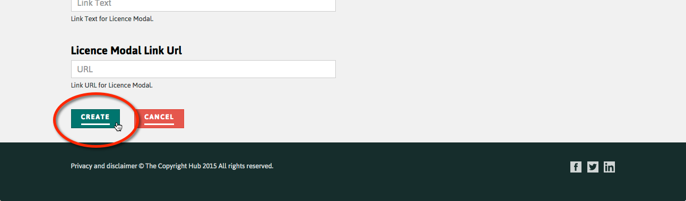
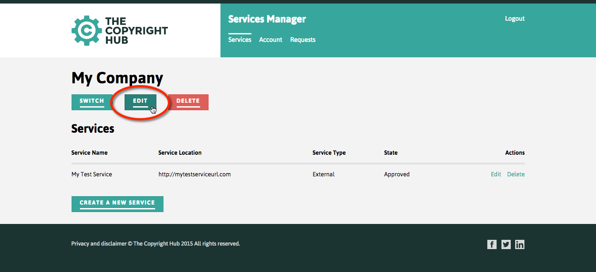
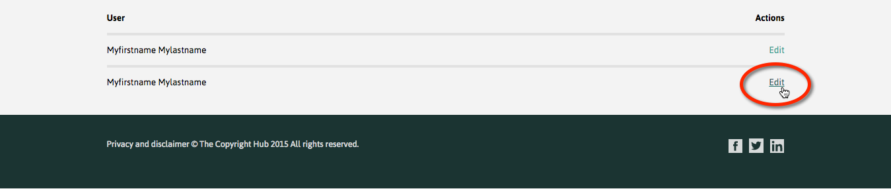

<!--
(C) Copyright Open Permissions Platform Coalition 2016
 -->

# How to create and manage accounts, services, and users

## Contents

+ [About this document](#about-this-document)
  + [See also](#see-also)
+ [Overview](#overview)
  + [Approval](#approval)
  + [Production and staging](#production-and-staging)
+ [Accounts service status in the current release](#accounts-service-status-in-the-current-release)
  + [Limitations](#limitations)
+ [New organisation and service registration](#new-organisation-and-service-registration)
+ [Basic account functions](#basic-account-functions)
 + [Sign up for an account](#sign-up-for-an-account)
 + [Register a new organisation](#register-a-new-organisation)
 + [Join an organisation](#join-an-organisation)
 + [Manage an organisation](#manage-an-organisation)
 + [Manage requests](#manage-requests)
 + [Update user account details](#update-user-account-details)
 + [Delete user account](#delete-user-account)
+ [Managing services](#managing-services)
 + [Register a new service](#register-a-new-service)
 + [Edit a service profile](#edit-a-service-profile)
 + [Delete a service](#delete-a-service)
 + [Manage Client Credentials](#manage-client-credentials)
+ [Managing Repositories](#managing-repositories)
 + [Create a new repository](#create-a-new-repository)
 + [Edit a repository](#edit-a-repository)
+ [Managing Offers](#managing-offers)
 + [Generate an Offer](#generate-an-offer)
 + [Load an Offer](#load-an-offer)
+ [Other admin functions](#other-admin-functions)
 + [Edit an organisation profile](#edit-an-organisation-profile)
 + [Assign user Role](#assign-user-role)

## About this document

This How-to describes how to use the Open Permissions Platform **Accounts
Service** web UI to sign up with the Hub, register a new organisation
and repositories, and add and manage services and manage users for the
new organisation.

For issues and support, contact
[support@openpermissions.org](mailto:support@openpermissions.org)
by email.

### See also

+ For details of the **Accounts Service** API, see the
[Accounts Service API reference](../apiary/api.md).

## Overview

Hub services are designed to be federated across multiple Hub
instances and accessed programatically by external web services and
application clients.

To use Hub APIs, external services must be registered. Registering a
service generates the OAuth client credentials required to request
access tokens for Hub APIs. Registration is easy and quick using the
**Accounts Service** Web UI.

Registered users can create and manage organisations, services,
repositories, client credentials, and offers. Admin users for an
organisation can manage other users for the organisation.

The underlying **Accounts Service** API provides a full suite of
account management functions that can be accessed programatically.

### Approval

+ New user sign up with the Hub does not require approval
+ New organisations must be approved by Hub admins
+ Requests by users to join an organisation must be approved by an
  admin for the organisation
+ New services must be approved by Hub admins
+ Requests to create a repository must be approved by the organisation
  that owns the Repository Service that will host the repository

### Production and staging

Staging endpoints should always be used when developing and testing
new services. Contact
[support@openpermissions.org](mailto:support@openpermissions.org)
by email for advice on migrating from staging to production endpoints.

## Accounts Service status in the current release

The **Accounts Service** web UI is live and stable in the current release.

### Limitations

+ There may be some delay in replicating account data to the staging
  service
+ Offer generation is not automated and requires some understanding of
  the underlying policy expression language
+ Currently offers are identified in the UI by their UUID not their
  descriptive name

## New organisation and service registration

To register a new organisation:

1. [Sign up for an account](#sign-up-for-an-account) if you have not
   already done so
2. When you receive the verification email, click the link to activate
   the account
2. Login and follow the steps to
   [Register a New Organisation](#register-a-new-organisation)

Note that new organisations must be approved by Hub admins.

To register a new service for an organisation:

1. Follow the steps to [Manage an organisation](#manage-an-organisation), or
   [Register a New Organisation](#register-a-new-organisation) if
   necessary, as above
2. Follow the steps to [Register a new service](#register-a-new-service)

Note that new services must be approved by Hub admins.

Once your service has been created and approved, you can
[create a new repository](#create-a-new-repository),
[generate an example offer](#generate-an-offer), and test the public Hub
APIs to
[onboard assets](https://github.com/openpermissions/onboarding-srv/blob/master/documents/markdown/how-to-onboard.md),
and to
[query onboarded assets](https://github.com/openpermissions/query-srv/blob/master/documents/markdown/how-to-query.md)
for offers.

Note that the [Offer Generator](#generate-an-offer) assumes some
understanding of the underlying policy expression language.

## Basic account functions

The following topics describe basic account functions.

### Sign up for an account

When you sign up you create a new user account. Once activated, the
account can be joined to an existing or new organisation.

To sign up, in your browser navigate to
http://services.copyrighthub.org/. The **Services Manager** welcome page
is displayed.

Click **Signup**:

Complete the signup form with your name and contact details. You will
receive an automated email asking you to verify your email address:

Click **Verify email address** and that's it!

You can now login with the details you provided.

### Register a new organisation

To use Hub services, an organisation must first register with the Hub,
and then register its services that will use the Hub.

To register an organisation, navigate to
http://services.copyrighthub.org/ and login with your account details.

On the **Services Manager** welcome page click the **Create a new
organisation** button:

The **Create a New Organisation** form displays.

To get up and running quickly, provide **Name** and **Description**
information for your organisation and leave all other fields blank,
for example:

+ Name &mdash; `My Company`
+ Description &mdash; `Example new organisation name`

Click the **Create** button at the bottom of the form:

Note that the new organisation request must be approved by a Hub
admin before the organisation appears in the **Existing
Organisations** dropdown list.

You will receive an email notification when your request has been
approved.

### Join an organisation

Navigate to http://services.copyrighthub.org/ and login with your
account details.

You will be asked to select, create, or join an organisation.

To join a new organisation, click
the **Join an existing organisation** button:

Click the dropdown to bring up the list of all organisations, and
select the organisation you wish to join:

Click the **Join** button to confirm your selection.

Note that your joining request must be approved by an admin for the
organisation.

You will receive an email notification when your request has been
approved.

### Manage an organisation

Navigate to http://services.copyrighthub.org/ and login with your
account details.

Open the drop down list and select the organisation to manage:

The organisation home page launches.

From this page you can:

+ **Switch** between organisations if you are a member of more than
  one organisation
+ **Edit** or **Delete** the organisation profile, see
  [Other admin functions](#other-admin-functions)
+ Register and [manage **Services**](#managing-services) for the organisation
+ Create and [manage **Repositories**](#managing-repositories)
+ Launch the [**Offer Generator**](#managing-offers)

Note that only **admin** users will see the **Edit** and **Delete**
buttons.

Additionally from the tabs on the organisation home page you can:

+ **Account** &mdash; manage your user profile, including password change
+ **Requests** &mdash; view your pending requests, and manage requests if
  you are an organisation admin
  
### Manage requests

Users can track the progress of requests they have made to create new
services.

Follow the steps to [Manage an organisation](#manage-an-organisation)
and select **Requests**.

Any requests that are pending will be listed on the dashboard:

Admin users have an additional option to **Manage Requests**:

From the dashboard, organisation admins can approve or reject requests
made by new or non-admin users.

### Update user account details

All users can update their basic account information.

Navigate to http://services.copyrighthub.org/ and login with your account
details. Select the **Account** tab:

The **Account** dashboard launches, allowing you to change your
contact details and password.

Note that only organisation admins can assign or change user
Roles. See [Assign user Role](#assign-user-role) below.

### Delete user account

Currently users can delete their own accounts, but only Hub admins can
delete another user's account.

To cancel your account as a user, login and follow the steps to
[Update user account details](#update-user-account-details) above.

Click on the **Cancel My Account** button at the bottom of the
**Account** dashboard page:

Confirm the deletion when prompted by the dialog:

**NOTE**: Deleting your account removes your user details from the
  Accounts Service, but does **not delete creation data that was
  onboarded from the account**. All data remains in the repository.

## Managing services

The following topics describe how to manage services.

### Register a new service

Services are web or other application clients that programmatically
access Hub APIs. This includes Hub microservices from one Hub
interacting with those of another Hub, as well as external services
that use public Hub endpoints, for example client applications calling
the Onboarding and Query services.

Individual services are always registered to a specific
organisation. Only users from that organisation can create new
services, and require the necessary account privileges to do so.

To register a new service, follow the steps to
[Manage an organisation](#manage-an-organisation) above.

Click on the **Create a New Service** button:

The **New Service** dialog launches:

Complete the details:

+ **Name** &mdash; Choose a name for the new service
+ **Location** &mdash; the URL at which the service will operate on
  the web, or the public web page for the service or app
  + Note: Include a protocol prefix, for example `http://`
+ **Service Type** &mdash; one of the listed service types:

Unless you are running a Hub instance, the service type should always
be **External**:

Click the **Create** button:

If approved by Hub admins, the new service is added to the
organisation home page:

### Edit a service profile

To edit a service profile, you must either:

+ Be the user who created the service
+ Or, have Admin privileges with the organisation account that owns
  the service

Follow the steps to [Manage an organisation](#manage-an-organisation)
from an account with Admin privileges. The organisation home page
launches listing current services.

Select **Edit** against the service you want to edit:

The **Service** profile page is displayed.

From here you can manage:

+ **Service Details** &mdash; basic details, see
[Register a new service](#register-a-new-service) above
+ **OAuth Credentials** &mdash; see
[Manage Client Credentials](#manage-client-credentials) below
+ **Access Permissions** &mdash; we recommend you use the default
**Access Permissions** setting of `All Services Read/Write`. Contact
[support@openpermissions.org](mailto:support@openpermissions.org)
by email if you have a requirement for stricter permissions

### Delete a service

To delete a service, you must either:

+ Be the user who created the service
+ Or, have Admin privileges with the organisation account that owns the
  service

Follow the steps to [Manage an organisation](#manage-an-organisation)
from an account with Admin privileges. The organisation home page
launches listing current services.

Select **Delete** against the service you want to delete:

Confirm the deletion when prompted by the dialog. The service is
remove from the list.

### Manage Client Credentials

To request OAuth tokens from the Authentication Service, services and
application clients must supply a Client ID and Client Secret. These
are unique for each service, and are initially generated automatically
when the service is created.

New values can be generated at any time from the **Services** profile
page.

Follow the steps in [Edit a service profile](#edit-a-service-profile)
and scroll to the **OAuth Credentials** section:

## Managing Repositories

Each organisation is responsible for creating and managing its own
repositories.

Because repositories are hosted by a Repository Service, requests to
create a repository must be approved by the organisation that owns the
Repository Service instance.

### Create a new repository

To create a new repository, follow the steps to
[Manage an organisation](#manage-an-organisation) above.

The organisation home page launches.

Select the **Repositories** button to switch to the Repositories
dashboard, and click on **Create a New Repository**:

The **Create a New Repository** dialog launches:

+ Provide a descriptive name for the new repository
+ Select the repository service instance that will host the new repository

Click **Create** to create the repository.

The new repository is added to the repository list. Note that its
status will show as **Pending** until it has been approved by admins for
the organisation that owns the Repository Service that will host it:

+ **Repository Name** is the descriptive name for this repository
+ **Repository ID** is the generated UUID for this repository, which
  you should supply in API calls that require a repository ID
+ **Service Name** is the name of the hosting Repository Service, you
  should supply the UUID for this service in the `delegate` scope in
  API calls when onboarding assets
+ **Service Organisation** is the name of the organisation that owns
  the hosting Repository Service and whose approval is required for
  this repository

### Edit a repository

Follow the steps [above](#create-a-new-repository) to navigate to the
Repositories dashboard.

Click the **Edit** button for the repository you want to edit.

The Repository settings page opens:

We recommend you keep the default settings.

## Managing Offers

Offers are terms of use for an asset. Offers are expressed using the
ODRL Policy Language and are based on the
[ODRL Version 2.1 Core Model](https://www.w3.org/community/odrl/model/2-1/)
extended with the Hub **Open Licensing** profile.

By default a new repository is empty. Before you can link assets to an
offer, you must first generate and save the offer to the repository.

If you have saved offers in your repository, you can load and edit
them to create variants and save them to the repository. For example,
if you already have an offer that provides non-commercial use for £5,
and you want to create a new offer that is identical except for price,
you can load the original offer, change the price, and save to create
a new offer.

Use the **Offer Generator** to generate, load, and save offers.

### Generate an Offer

To generate an offer, follow the steps to
[Manage an organisation](#manage-an-organisation) above.

The organisation home page launches.

Select the **Offer Generator** button to switch to the Offer Generator
dashboard.

Select the Repository in which the offer should be generated.

Click the **New Offer** button.

The **New Offer** form launches:

+ **Title** is the descriptive name of this offer
+ **Policy Description**
+ **Policy Text**
+ **Assigner**

The offer details are created as custom rules that express the policy
using ODRL 2.1 rule types:

+ **Permission** &mdash; actions the assignee is permitted to perform
  on the associated asset set
+ **Prohibition** &mdash; actions the assignee is prohibited from
  performing on the associated asset set
+ **Target** &mdash; the associated asset set
+ **Duty** &mdash; requirements which must be fulfilled in order to
  receive the permission

To create a rule, select a rule type and use the qualifiers to specify
the rule conditions:

+ **Permission**, **Prohibition**, and **Duty** &mdash; Select an
**Action** and set at least one constraint using **Add Constraint**
+ **Target** &mdash; Specify **Count** and **Set**

When you click the **Action** dropdown, for example to add a **Prohibition**,
all possible actions from the Hub ODRL vocabulary are listed:

>Note: Whenever you specify an action you must also specify at least
>one constraint.

Similarly when you click the **Constraint** dropdown, all possible
constraints from the Hub ODRL vocabulary are listed:

Qualify constraints by selecting an appropriate **Operator** from the
dropdowns:

and optionally specifying a **Unit**:

When you **Save** the offer, the newly generated offer is listed on
the offer generator dashboard:

>Note: Currently offers are identified in the UI by their UUID not
>their descriptive **Name**, so you should make a note of the mappings
>if you are using multiple offers.

You can refer to the offer by its UUID.

You can now link assets to the offer by UUID.

### Load an Offer

Follow the steps [above](#generate-an-offer) to go to the Offer
Generator dashboard.

+ Select the Repository containing the offer to be loaded:

+ Select an Offer from the dropdown:

All offers that have been generated for this repository using the
offer generator are listed in the dropdown.

>Note: Currently offers are identified in the UI by their UUID not
>their descriptive **Name**, so you should make a note of the mappings
>if you are using multiple offers.

Edit the offer in the **Offer Generator** to create a variant. Click
**Save Offer** to save the offer into the repository.

You can refer to the offer by its UUID.

You can now link assets to the offer by UUID.

## Other admin functions

The following topics describe the Admin functions for organisation
admins.

### Edit an organisation profile

To edit an organisation profile, you must have Admin privileges with
the organisation. The organisation admin, who by default is the user
who registered the organisation, can assign appropriate privileges.

Follow the steps to [Manage an organisation](#manage-an-organisation)
from an account with Admin privileges. The organisation home page
launches.

Click the **Edit** button:

The profile includes:

+ General organisation information including name and contact details
+ Website URL and redirect required for web integration with Hub services
+ Display text for licence popups

Contact
[support@openpermissions.org](mailto:support@openpermissions.org)
by email to discuss web integration and licence requirements.

### Assign user Role

Organisation admins can assign Roles to other users from
their organisation. By default only two roles are defined:

+ User &mdash; an ordinary user without privileges
+ Admin &mdash; a user with privileges, can edit organisation and service details for the organisation to which they belong

An organisation can create additional custom roles using the Accounts
Service API directly, see the
[Accounts Service API reference](../apiary/api.md).

To update a user Role, follow the steps to
[Manage an organisation](#manage-an-organisation) from an account with
Admin privileges and select **Account** as above.

Admin users have an additional option to **Manage Users**:

Click to launch the **Users** dashboard:

Click **Edit** under the **Actions** column:

The **Edit user roles** dialog launches:

Select the Role you wish to assign to the user and click Save to
update the user's profile:

