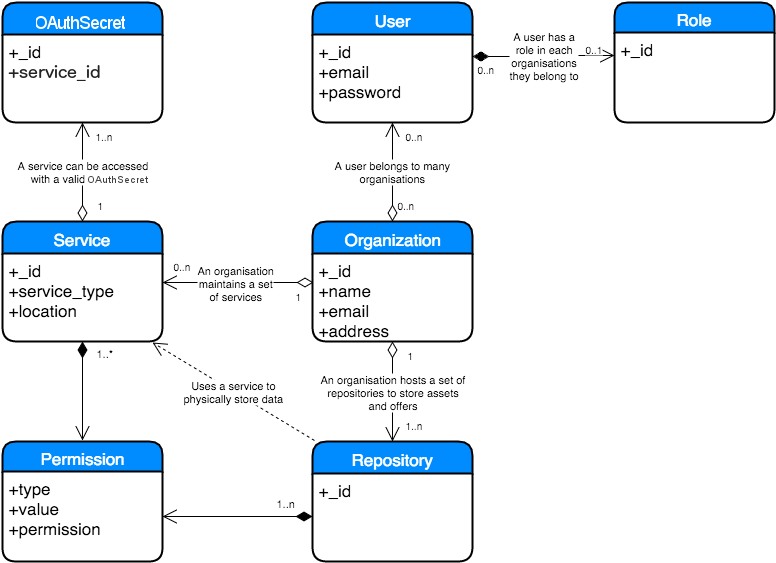

# Accounts Service Low Level Design

## Contents
+ [Classes](#classes)
+ [Resource Relationship](#resource-relationship)
  + [User](#user)
  + [Role](#role)
  + [Organisation](#organisation)
  + [Service](#service)
  + [Certificate](#certificate)
  + [Repository](#repository)
+ [Access control hierarchy](#access-control-hierarchy)
  + [Access control examples](#access-control-examples)
+ [Service start up](#service-start-up)
+ [Data storage](#data-storage)
+ [Login process](#login-process)
+ [Adding a user](#adding-a-user)

## Classes
+ user
+ organisation
+ service
+ repository
+ OAuthSecret 

## Class Relationship


### User
The **user** class represents, as expected, a user of the system.
#### Role
When a **user** is added to an **organisation** they will be assigned a
**role**. If they are given an *administrator* role they will be able to
maintain information and users belonging to the **organisation** otherwise they
will only be able to read information.
Users given the role of *System Administrator* will have access to all
facilities.

### Organisation
An **organisation** within the Hub supplies and stores information on assets
and the offers available for them.


### Service
A **service** represents any service used to implement the Hub along with any
client service. All services must belong to an **organisation**.

### Repository
A **repository** is used by an **organisation** to store its assets and
offers.

### OAuthSecret
A **service** can have multiple **OAuthSecrets** which are used for OAuth2 authentication 
between services.

## Access control hierarchy
The precedence rules for access control have been based on NTFS file access
rules (http://www.ntfs.com/ntfs-permissions-precedence.htm).

However instead of a file/folder hierarchy we will use the following hierarchy:

+ All organisations
  + Service Type
    + Organisation Id

1. Permissions applied directly to an organisation id (explicit permissions)
  will take precedence over permissions based on a service service type or all
  organisations.

1. Permissions inherited from near relatives take precedence over permissions
  inherited from distant predecessors. (i.e: Permissions that apply to service
  type will take precedence over permissions applied to all organisations).

1. If no permission level is specified for an organisation, said organisation
  is assumed not to have access.

### Access control examples
In the following examples we are assuming we have a service,
**exampleco_repo_srv** with the following properties

```json
{
   "_id": "1234",
   "organisation_id": "exampleco",
   "service_type": "repository"
}
```

#### Example 1
A service has the following permissions

```json
[
    {"type": "organisation_id", "value": "exampleco", "permission": "r"}, 
    {"type": "service_type", "value": "repository", "permission": "w"}
]
```

These permission match on both **organisation_id** and **service_type**.
As **organisation_id** has the highest order of precedence,
**exampleco_repo_srv** will have **read** access to this new service.

#### Example 2
A service has the following permissions

```json
[
    {"type": "organisation_id", "value": "testco", "permission": "w"}, 
    {"type": "service_type", "value": "repository", "permission": "rw"}
]
```

These permission matches only on **service_type** giving
**exampleco_repo_srv** **read and write** access to this new service.

#### Example 3
A service has the following permissions

```json
[
    {"type": "organisation_id", "value": "exampleco", "permission": "-"}, 
    {"type": "service_type", "value": "repository", "permission": "rw"}
]
```

These permission match on both **organisation_id** and **service_type**.
As **organisation_id** has the highest order of precedence,
**exampleco_repo_srv** will have **no** access to this new service.

#### Example 4
A service has the following permissions

```json
[
    {"type": "organisation_id", "value": "testco", "permission": "r"}, 
    {"type": "service_type", "value": "index", "permission": "w"}
]
```

These permission have no matches so **exampleco_repo_srv** will have **no**
access to this new service.

#### Example 5
A service has the following permissions

```json
[
    {"type": "all", "value": "None", "permission": "r"}, 
    {"type": "service_type", "value": "repository", "permission": "w"}
]
```

These permission match on both **all** and **service_type**.
As **service_type** has the highest order of precedence,
**exampleco_repo_srv** will have **write** access to this new service.

#### Example 6
A service has the following permissions

```json
[
    {"type": "all", "value": "None", "permission": "r"}, 
    {"type": "service_type", "value": "index", "permission": "w"}
]
```

These permission matches only on **all** giving **exampleco_repo_srv** **read**
access to this new service.

## Service start up

The first time the service is started up a default user, **administrator**,
needs to be created with a default password. This user can never be deleted.

It is advised that the password is manually changed for security reasons.

## Data storage

Details on all users, organisations and services need to be persistent.
As a minimum all passwords need to be encrypted.

## Login process

The login process should return a token that has an expiration time based on
the last time the token was used.

The token is required to be sent for all HTTP POST and PUT operations on the
service except the login process that returns the token.

The token is also required for HTTP GET operations that are not public.

The token needs to be unique every time a user logs in.

## Adding a user

